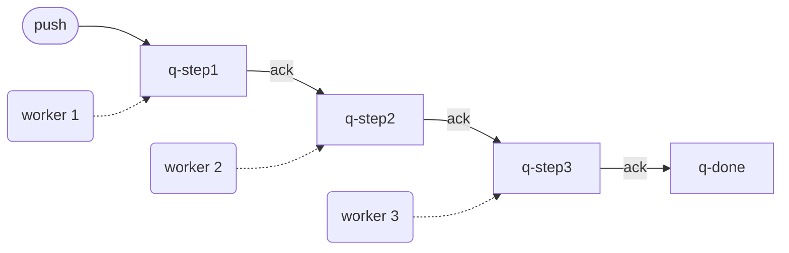
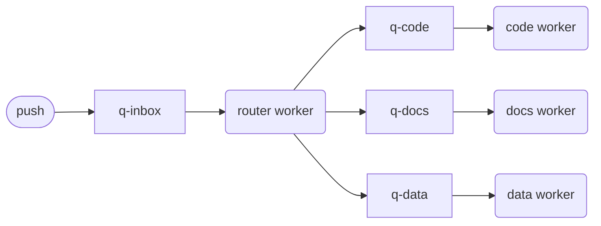
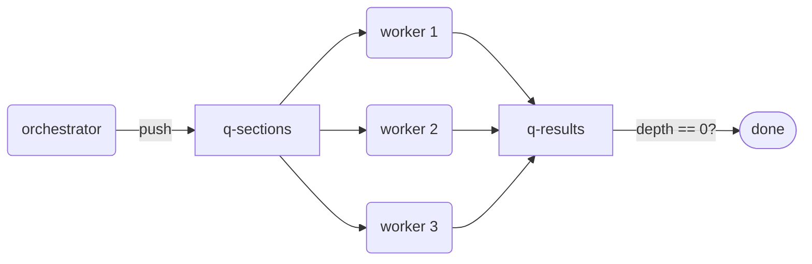
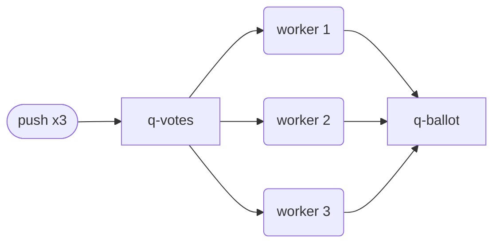
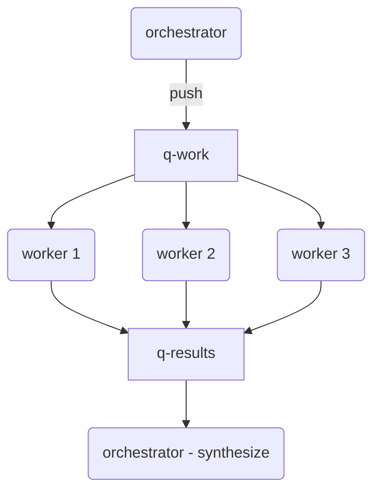
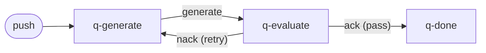
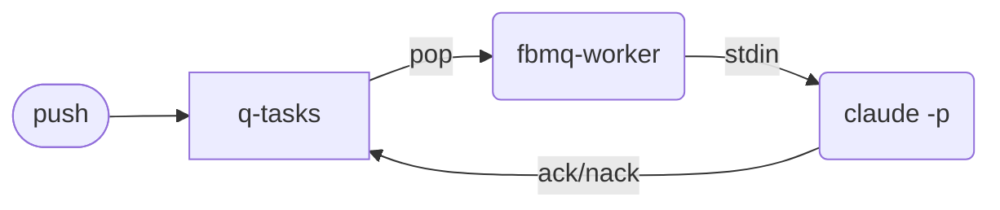

# Agent Patterns with fbmq

How each of Anthropic's composable agent patterns maps to fbmq primitives,
with complete shell examples you can run directly. Every example uses only the
`fbmq` CLI, `fbmq-worker`, `claude -p`, and standard shell.

Source: [Building Effective Agents](https://www.anthropic.com/research/building-effective-agents) (Anthropic, 2024)

All scripts use `${QUEUE_ROOT:-/tmp}` so you can override the base path:

```bash
QUEUE_ROOT=~/my-queues sh examples/1-prompt-chaining/run.sh
```

---

## 1. Prompt Chaining

Run a task through a fixed sequence of LLM steps, where each step's output
feeds the next. An `ack` gates each transition — if step 2 fails, the
message stays in its queue for retry without corrupting downstream work.



Each handler receives a message on stdin, calls Claude, and pushes the result
to the next queue. The chain topology enforces the sequence — no routing
headers needed.

**Scripts:** [`examples/1-prompt-chaining/`](examples/1-prompt-chaining/)

| File | Role |
|------|------|
| `step1-handler.sh` | Generate outline, push to step 2 |
| `step2-handler.sh` | Expand outline into draft, push to step 3 |
| `step3-handler.sh` | Edit draft, save final result |
| `run.sh` | Init queues, start workers, push a sample task |

Run the full example: `sh examples/1-prompt-chaining/run.sh`

**Key header:** None required — the queue topology itself enforces the sequence.

---

## 2. Routing

A single router worker reads each incoming message and dispatches it to a
specialized queue based on the content, tags, or priority.



The router inspects each message (optionally using `Tags` or calling Claude
for classification) and pushes it to the appropriate downstream queue. Each
specialized worker handles only its domain.

**Scripts:** [`examples/2-routing/`](examples/2-routing/)

| File | Role |
|------|------|
| `router.sh` | Classify task and dispatch to code/docs/data queue |
| `code-handler.sh` | Handle code tasks |
| `docs-handler.sh` | Handle documentation tasks |
| `run.sh` | Init queues, start workers, push sample tasks |

Run the full example: `sh examples/2-routing/run.sh`

**Key header:** `Tags` (`-T`) — the router can inspect tags with
`fbmq inspect` instead of (or in addition to) calling the LLM.

---

## 3. Parallelization — Sectioning

Split a large task into independent sections, fan out to parallel workers,
then aggregate when all are done.



The orchestrator pushes each section with a shared `Correlation-Id`. Multiple
workers process sections concurrently. The run script polls `fbmq depth`
until all results arrive.

**Scripts:** [`examples/3-parallelization-sectioning/`](examples/3-parallelization-sectioning/)

| File | Role |
|------|------|
| `section-handler.sh` | Process one section, push result |
| `run.sh` | Fan out sections, start workers, poll for completion |

Run the full example: `sh examples/3-parallelization-sectioning/run.sh`

**Key header:** `Correlation-Id` (`-c`) — ties all sections to the same batch.

---

## 4. Parallelization — Voting

Push the same task N times, collect independent answers, and pick the
majority or best result.



Each worker independently evaluates the same question. The run script waits
for all votes and tallies the results.

**Scripts:** [`examples/4-parallelization-voting/`](examples/4-parallelization-voting/)

| File | Role |
|------|------|
| `voter.sh` | Cast an independent vote on a task |
| `run.sh` | Push task 3x, start workers, tally results |

Run the full example: `sh examples/4-parallelization-voting/run.sh`

**Key header:** `Correlation-Id` (`-c`) — groups votes for the same question.

---

## 5. Orchestrator-Workers

A central orchestrator dynamically breaks a task into subtasks at runtime,
pushes them to a work queue, and tracks completion via `Correlation-Id` and
`depth`.



The orchestrator asks Claude to decompose the task, pushes each subtask, then
waits for all results and synthesizes them into a final deliverable.

**Scripts:** [`examples/5-orchestrator-workers/`](examples/5-orchestrator-workers/)

| File | Role |
|------|------|
| `orchestrate.sh` | Decompose task into subtasks, push to work queue |
| `work-handler.sh` | Complete a subtask, push result |
| `run.sh` | Init queues, start workers, orchestrate, synthesize |

Run the full example: `sh examples/5-orchestrator-workers/run.sh`

**Key header:** `Correlation-Id` (`-c`) — the orchestrator generates one ID
per task and uses it to track which results belong together.

---

## 6. Evaluator-Optimizer

A two-queue feedback loop: one worker generates output, another evaluates
it. If the evaluation fails, the task goes back for another attempt.
`Retry-Count` caps the iterations.



The generator produces a solution and forwards it (along with the original
prompt) to the evaluator. The evaluator replies PASS or FAIL — on failure,
feedback is sent back to the generator for another round, up to a retry limit.

**Scripts:** [`examples/6-evaluator-optimizer/`](examples/6-evaluator-optimizer/)

| File | Role |
|------|------|
| `generate-handler.sh` | Generate solution, send to evaluator |
| `evaluate-handler.sh` | Evaluate solution; pass or retry |
| `run.sh` | Init queues, start workers, push a sample task |

Run the full example: `sh examples/6-evaluator-optimizer/run.sh`

**Key header:** `Retry-Count` — tracks iterations through the loop.
The evaluator checks it to enforce a maximum number of refinement cycles.

---

## 7. Autonomous Agent

The simplest pattern: `fbmq-worker` polls a queue and runs `claude -p` for
each task. The agent runs autonomously in the background — push tasks
whenever you want and they get processed.



The handler simply pipes each message through Claude and saves the output.
Priority headers control processing order.

**Scripts:** [`examples/7-autonomous-agent/`](examples/7-autonomous-agent/)

| File | Role |
|------|------|
| `agent-handler.sh` | Process task with Claude, save output |
| `run.sh` | Init queue, start background worker, push sample tasks |

Run the full example: `sh examples/7-autonomous-agent/run.sh`

**Check on it:**

```bash
fbmq depth /tmp/agent-tasks        # tasks remaining
ls /tmp/agent-output/               # completed results
tail -f /tmp/agent.log              # live worker logs
ls /tmp/agent-tasks/failed/         # anything that failed
```

**Key header:** `Priority` (`-p`) — critical and high tasks get processed
before normal and low ones (requires `fbmq init --priority`).

---

## Header Reference

| Header | CLI flag | Pattern use |
|--------|----------|-------------|
| `Priority` | `-p critical\|high\|normal\|low` | Autonomous agent, routing |
| `Correlation-Id` | `-c <id>` | Orchestrator, parallelization, evaluator |
| `Tags` | `-T <tag>` (repeatable) | Routing, classification |
| `Retry-Count` | (automatic on nack) | Evaluator-optimizer iteration guard |
| `TTL` | `-t <seconds>` | Time-bounded tasks, auto-expiry via `fbmq reap` |
| `Created-By` | `-b <name>` | Audit trail across multi-agent systems |
