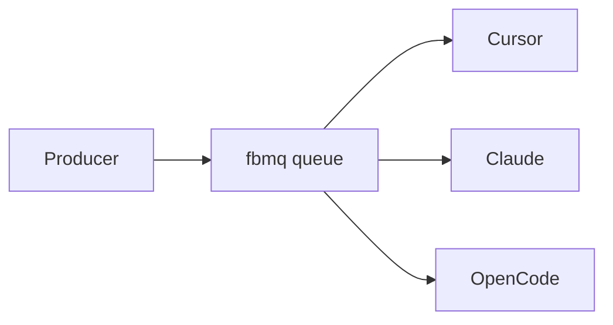

# fbmq — A message queue for local agents

A file-based queue for local AI agents and workers: no broker, no cloud—just
directories and Markdown. Every message is a file, every queue is a directory,
and `rename(2)` is the sole coordination primitive. Ideal for local LLM
pipelines, cron workers, and multi-step agent workflows.

- [NotebookLM](https://notebooklm.google.com/notebook/04836816-b49d-49f1-b451-45ef65d39035) — AI notebook over project sources
- [DeepWiki](https://deepwiki.com/swiftugandan/fbmq) — Codebase index and navigation

## Quick Start

```bash
make
sudo make install

fbmq init /var/queue/jobs

echo "# Deploy v2.1" | fbmq push /var/queue/jobs -p high
# a3f2e1b4c5d6a7b8c9d0e1f2a3b4c5d6

CLAIMED=$(fbmq pop /var/queue/jobs)
cat "$CLAIMED"                           # read the message
fbmq ack /var/queue/jobs "$CLAIMED"      # done
fbmq nack /var/queue/jobs "$CLAIMED"     # retry
```

## Messages are Markdown

```markdown
Id: a3f2e1b4c5d6a7b8c9d0e1f2a3b4c5d6
Created-At: 2026-02-26T14:30:01.123456789Z
Created-By: 28431@worker-12
Priority: high
Retry-Count: 0
TTL: 3600
Tags: deploy, urgent
Correlation-Id: req-abc-123

# Deploy v2.1

Expedited rollout requested.
```

The filename **is** the ID. The first two characters **are** the bucket.

## Directory Layout

```
/var/queue/jobs/
    pending/00..ff/    256 hash-sharded buckets
    processing/        Claimed (timestamp-prefixed filenames)
    done/              Completed
    failed/            Dead-letter
    .tmp/              Atomic write staging
```

## Commands

| Command | Description |
|---------|-------------|
| `fbmq init <dir> [--priority]` | Create a queue |
| `fbmq push <dir> [opts] [file]` | Enqueue (prints ID) |
| `fbmq pop <dir>` | Claim next message (prints path) |
| `fbmq ack <dir> <path>` | Mark done |
| `fbmq nack <dir> <path>` | Return for retry / dead-letter |
| `fbmq depth <dir>` | Queue depth (full scan of all 256 buckets + processing) |
| `fbmq inspect <file>` | Show metadata |
| `fbmq cat <file>` | Print body only (strip frontmatter) |
| `fbmq reap <dir> [-l secs]` | Reclaim stale + expire TTL |
| `fbmq purge <dir> [-a secs]` | Delete old done messages |

## Operations with Unix tools

```bash
grep -rl "Priority: critical" pending/     # find critical
cat pending/a3/a3f2...md                   # inspect
mv failed/a3f2...md pending/a3/a3f2...md   # manual retry
inotifywait -mr pending/                   # monitor
find done/ -mtime +7 -delete               # purge
```

## Example: agent harness (Claude, Cursor, OpenCode)

One process (or a human) pushes tasks with a tag indicating which agent should
handle them; each agent runs a loop: pop, process the claimed file, ack or
nack. No broker—just the shared queue directory.



**Task format.** Tag each message so agents can route: use `-T cursor`, `-T claude`, or `-T opencode` when pushing. The body is the instruction. Use `Correlation-Id` for multi-step pipelines (e.g. design → implement → test).

```markdown
Id: a1b2c3d4e5f6...
Tags: cursor
Correlation-Id: pipeline-42

# Implement login in src/auth.c

Add a login function that validates credentials and returns a session token.
```

**Producer:** push tasks to the same queue with different tags:

```bash
echo "Implement login in src/auth.c" | fbmq push /var/queue/agents -T cursor -p high
echo "Review the API design in docs/spec.md" | fbmq push /var/queue/agents -T claude -p normal
echo "Add unit tests for src/auth.c" | fbmq push /var/queue/agents -T opencode -p normal
```

**Consumer loop.** Each agent runs the same pattern: pop, check if the tag matches this agent, process, then ack (or nack to return the message to the queue).

```bash
QUEUE=/var/queue/agents
AGENT=cursor   # or claude / opencode

while CLAIMED=$(fbmq pop "$QUEUE"); [ -n "$CLAIMED" ] && [ -f "$CLAIMED" ]; do
  if grep -q "Tags:.*$AGENT" "$CLAIMED"; then
    # Agent-specific work (placeholder — plug in your integration):
    # Cursor: pass $CLAIMED as task/context; Cursor edits repo; ack on success
    # Claude: send body to Claude API/CLI; write reply; ack
    # OpenCode: run OpenCode with task from $CLAIMED; ack on success
    fbmq ack "$QUEUE" "$CLAIMED"
  else
    fbmq nack "$QUEUE" "$CLAIMED"
  fi
done
```

- **Cursor:** Pass `$CLAIMED` to Cursor as context or task file; Cursor edits the repo; ack when done.
- **Claude:** Send the message body to the Claude API (or CLI), append or write the reply; ack.
- **OpenCode:** Run OpenCode with the task from `$CLAIMED`; ack on success.

Run the producer (script or manual `fbmq push`); run each agent's loop in a separate terminal or under systemd/cron. Use `fbmq depth /var/queue/agents` to inspect backlog.

## Cron

```crontab
* * * * * fbmq-reaper /var/queue/jobs 300 604800
```

## Build

```bash
make            # build CLI + libraries
make fbmq       # build CLI binary only
make libs       # build libfbmq.a + libfbmq.so/dylib + fbmq.pc
make test       # 50+ integration tests
make install    # install everything (binary, libs, header, man pages)
make install-bin   # install CLI binary + man pages only
make install-lib   # install libraries + header + pkg-config only
```

Requires: GCC/Clang, GNU Make, Linux or macOS. No external libraries.

## Library Usage

fbmq ships as both a CLI tool and a C library (`libfbmq.a` / `libfbmq.so`).

```c
#include <fbmq.h>
#include <stdio.h>
#include <string.h>

int main(void) {
    fbmq_queue_t q;
    fbmq_queue_defaults(&q);

    if (fbmq_init(&q, "/var/queue/jobs") != 0)
        return 1;

    fbmq_message_t msg = {0};
    msg.header.priority = FBMQ_PRIO_HIGH;
    msg.body     = "# Deploy v2.1\n\nRoll it out.\n";
    msg.body_len = strlen(msg.body);

    fbmq_enqueue(&q, &msg);
    printf("enqueued: %s\n", msg.header.id);
    return 0;
}
```

Compile with pkg-config:

```bash
gcc -o myapp myapp.c $(pkg-config --cflags --libs fbmq)
```

Or link directly:

```bash
gcc -o myapp myapp.c -lfbmq
```

## Man pages

```bash
man fbmq            # command reference
man fbmq-message    # message format
man fbmq-design     # architecture
```

## License

MIT
