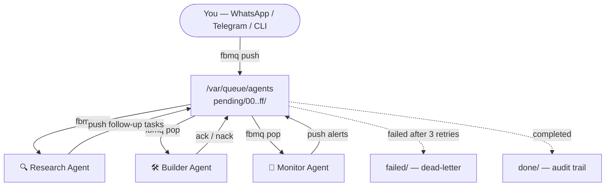

# fbmq — A message queue for local agents

A file-based queue for local AI agents and workers: no broker, no cloud—just
directories and Markdown. Every message is a file, every queue is a directory,
and `rename(2)` is the sole coordination primitive. Ideal for local LLM
pipelines, cron workers, and multi-step agent workflows.

- [NotebookLM](https://notebooklm.google.com/notebook/04836816-b49d-49f1-b451-45ef65d39035) — AI notebook over project sources
- [DeepWiki](https://deepwiki.com/swiftugandan/fbmq) — Codebase index and navigation

## Quick Start

```bash
make
sudo make install

fbmq init /var/queue/jobs

echo "# Deploy v2.1" | fbmq push /var/queue/jobs -p high
# a3f2e1b4c5d6a7b8c9d0e1f2a3b4c5d6

CLAIMED=$(fbmq pop /var/queue/jobs)
cat "$CLAIMED"                           # read the message
fbmq ack /var/queue/jobs "$CLAIMED"      # done
fbmq nack /var/queue/jobs "$CLAIMED"     # retry
```

## Messages are Markdown

```markdown
Id: a3f2e1b4c5d6a7b8c9d0e1f2a3b4c5d6
Created-At: 2026-02-26T14:30:01.123456789Z
Created-By: 28431@worker-12
Priority: high
Retry-Count: 0
TTL: 3600
Tags: deploy, urgent
Correlation-Id: req-abc-123

# Deploy v2.1

Expedited rollout requested.
```

The filename **is** the ID. The first two characters **are** the bucket.

## Directory Layout

```
/var/queue/jobs/
    pending/00..ff/    256 hash-sharded buckets
    processing/        Claimed (timestamp-prefixed filenames)
    done/              Completed
    failed/            Dead-letter
    .tmp/              Atomic write staging
```

## Commands

| Command | Description |
|---------|-------------|
| `fbmq init <dir> [--priority]` | Create a queue |
| `fbmq push <dir> [opts] [file]` | Enqueue (prints ID) |
| `fbmq pop <dir>` | Claim next message (prints path) |
| `fbmq ack <dir> <path>` | Mark done |
| `fbmq nack <dir> <path>` | Return for retry / dead-letter |
| `fbmq depth <dir>` | Queue depth (full scan of all 256 buckets + processing) |
| `fbmq inspect <file>` | Show metadata |
| `fbmq cat <file>` | Print body only (strip frontmatter) |
| `fbmq reap <dir> [-l secs]` | Reclaim stale + expire TTL |
| `fbmq purge <dir> [-a secs]` | Delete old done messages |

## Operations with Unix tools

```bash
grep -rl "Priority: critical" pending/     # find critical
cat pending/a3/a3f2...md                   # inspect
mv failed/a3f2...md pending/a3/a3f2...md   # manual retry
inotifywait -mr pending/                   # monitor
find done/ -mtime +7 -delete               # purge
```

## Use Case: Local Task Backbone for OpenClaw & AI Agents

[OpenClaw](https://github.com/openclaw/openclaw) (150K+ GitHub stars) and
its derivatives (Clawdbot, Moltbot) are autonomous AI agents that run locally
and actually *do things* — send emails, manage calendars, browse the web,
orchestrate multi-step workflows. But every agent needs a task queue. Most
reach for Redis or a cloud broker. OpenClaw agents don't need that — they need
a directory.

fbmq gives your local agents a **persistent, priority-aware, crash-safe task
queue** where every task is a Markdown file the agent already knows how to
read. No daemon. No port. No SDK. Just `push`, `pop`, `ack`.

### Why fbmq fits OpenClaw

| OpenClaw needs | fbmq provides |
|----------------|---------------|
| Persistent task memory across sessions | Messages are files — survive reboots, crashes, and restarts |
| Priority routing (urgent vs. routine) | `--priority` queues: critical → high → normal → low |
| Multi-agent coordination without race conditions | `rename(2)` — one agent wins the claim, others retry |
| Failure handling for flaky LLM calls | Auto-retry with dead-letter after N failures |
| Pipeline correlation (research → act → verify) | `Correlation-Id` ties multi-step chains together |
| Full observability without a dashboard | `ls pending/`, `cat`, `grep` — the queue is a directory |

### Architecture



### Example: Multi-agent research pipeline

An orchestrator pushes a research request. A research agent picks it up,
gathers findings, and pushes a follow-up task for a builder agent to act on.
`Correlation-Id` ties the whole pipeline together. If the LLM call fails,
`nack` retries it — and dead-letters it after 3 attempts.

**1. Initialize a priority queue:**

```bash
fbmq init /var/queue/agents --priority
```

**2. Push tasks with tags, priority, and correlation:**

```bash
PIPELINE="research-$(date +%s)"

# Research task — high priority
cat <<'EOF' | fbmq push /var/queue/agents -T researcher -p high -c "$PIPELINE"
# Competitive landscape analysis

Find the top 5 alternatives to our product. For each, extract:
- Pricing tiers
- Key differentiators
- Recent funding or acquisitions

Output findings as structured Markdown.
EOF

# Builder task — queued at normal, runs after research
cat <<'EOF' | fbmq push /var/queue/agents -T builder -p normal -c "$PIPELINE"
# Build comparison dashboard

Using the research findings from this pipeline, generate a
single-page HTML dashboard comparing all 5 competitors.
EOF
```

**3. Each message is a human-readable Markdown file on disk:**

```markdown
Id: a3f2e1b4c5d6a7b8c9d0e1f2a3b4c5d6
Created-At: 2026-02-27T10:30:01.123456789Z
Priority: high
Tags: researcher
Correlation-Id: research-1740652201
Retry-Count: 0

# Competitive landscape analysis

Find the top 5 alternatives to our product. For each, extract:
- Pricing tiers
- Key differentiators
- Recent funding or acquisitions

Output findings as structured Markdown.
```

**4. Agent consumer loop — works with OpenClaw, Claude CLI, or any agent:**

```bash
QUEUE=/var/queue/agents
AGENT=researcher   # or builder / monitor

while CLAIMED=$(fbmq pop "$QUEUE"); [ -n "$CLAIMED" ] && [ -f "$CLAIMED" ]; do
  if grep -q "Tags:.*$AGENT" "$CLAIMED"; then
    BODY=$(fbmq cat "$CLAIMED")

    # Feed task to your agent (OpenClaw, Claude API, local LLM, etc.)
    if echo "$BODY" | openclaw run --skill research 2>/dev/null; then
      fbmq ack "$QUEUE" "$CLAIMED"    # done → done/
    else
      fbmq nack "$QUEUE" "$CLAIMED"   # retry → pending/ or failed/
    fi
  else
    fbmq nack "$QUEUE" "$CLAIMED"     # not for this agent — return it
  fi
done
```

**5. Observe everything with Unix tools:**

```bash
fbmq depth /var/queue/agents             # how many tasks pending?
grep -rl "Tags:.*researcher" pending/    # find all research tasks
grep -rl "Correlation-Id: research-1740" done/  # trace a pipeline
ls failed/                                # what died?
cat failed/*.md                           # why did it die?
```

### More agent patterns fbmq enables

| Pattern | How |
|---------|-----|
| **Morning briefing** (news + calendar + tasks) | Cron pushes a `briefing` task nightly; agent pops at 7am, assembles digest |
| **Multi-agent content factory** | `researcher` → `writer` → `editor` agents, chained via `Correlation-Id` |
| **Self-healing infra** | Monitor agent pushes `critical` alerts; repair agent pops and acts |
| **Inbox triage** | Email watcher pushes each message; classifier agent tags and routes |
| **RAG knowledge ingestion** | Drop URLs as tasks; agent pops, scrapes, chunks, and indexes |
| **Human-in-the-loop review** | Agent pushes results to a `review` queue; human inspects with `cat`, then `ack` or `nack` |

### Why not Redis / RabbitMQ / a cloud queue?

OpenClaw runs on your machine. fbmq runs on your filesystem. There's nothing
to install, no daemon to babysit, no port to expose, no credentials to leak.
Your entire agent state is `ls` and `cat`. Move a message from `failed/` to
`pending/` with `mv`. Edit a task mid-flight with `vim`. Pipe the dead-letter
queue to your LLM for root-cause analysis. Try that with Redis.

## Cron

```crontab
* * * * * fbmq-reaper /var/queue/jobs 300 604800
```

## Build

```bash
make            # build CLI + libraries
make fbmq       # build CLI binary only
make libs       # build libfbmq.a + libfbmq.so/dylib + fbmq.pc
make test       # 50+ integration tests
make install    # install everything (binary, libs, header, man pages)
make install-bin   # install CLI binary + man pages only
make install-lib   # install libraries + header + pkg-config only
```

Requires: GCC/Clang, GNU Make, Linux or macOS. No external libraries.

## Library Usage

fbmq ships as both a CLI tool and a C library (`libfbmq.a` / `libfbmq.so`).

```c
#include <fbmq.h>
#include <stdio.h>
#include <string.h>

int main(void) {
    fbmq_queue_t q;
    fbmq_queue_defaults(&q);

    if (fbmq_init(&q, "/var/queue/jobs") != 0)
        return 1;

    fbmq_message_t msg = {0};
    msg.header.priority = FBMQ_PRIO_HIGH;
    msg.body     = "# Deploy v2.1\n\nRoll it out.\n";
    msg.body_len = strlen(msg.body);

    fbmq_enqueue(&q, &msg);
    printf("enqueued: %s\n", msg.header.id);
    return 0;
}
```

Compile with pkg-config:

```bash
gcc -o myapp myapp.c $(pkg-config --cflags --libs fbmq)
```

Or link directly:

```bash
gcc -o myapp myapp.c -lfbmq
```

## Man pages

```bash
man fbmq            # command reference
man fbmq-message    # message format
man fbmq-design     # architecture
```

## License

MIT
